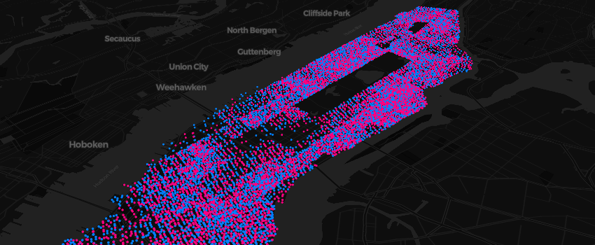

<!-- README.md is generated from README.Rmd. Please edit that file -->
mapboxer: An R Interface to Mapbox GL JS
========================================

<!-- badges: start -->
[](https://CRAN.R-project.org/package=mapboxer) [](https://travis-ci.org/crazycapivara/mapboxer) [](https://www.repostatus.org/#active) <!-- badges: end -->

Mapboxer makes [Mapbox GL JS](https://docs.mapbox.com/mapbox-gl-js/api/), an open source JavaScript library that uses WebGL to render interactive maps, available within R via the [htmlwidgets](https://www.htmlwidgets.org/) package.



Installation
------------

Install the release version from [CRAN](https://cran.r-project.org/) with:

``` r
install.packages("mapboxer")
```

Install the development version from [GitHub](https://github.com/) with:

``` r
# install.packages("remotes")
remotes::install_github("crazycapivara/mapboxer")
```

Usage
-----

``` r
library(mapboxer)

map <- motor_vehicle_collisions_nyc %>%
  dplyr::mutate(
    color = ifelse(injured == 0, "yellow", "red")
  ) %>%
  as_mapbox_source() %>%
  mapboxer(
    center = c(-73.9165, 40.7114),
    zoom = 10
  ) %>%
  add_navigation_control() %>%
  add_circle_layer(
    circle_color = c("get", "color"),
    circle_blur = 1,
    circle_stroke_color = "red",
    circle_stroke_width = 1,
    popup = "<p>{{date}} {{time}}</p><p>Number of persons injured: {{injured}}</p>"
  )

if (interactive()) map
```

By default mapboxer uses [Carto vector styles](https://github.com/CartoDB/basemap-styles) as basemaps. It is also possible to use raster tiles or a background color.

If you want to use styles from [Mapbox](https://www.mapbox.com/maps) it is recommended that you store your API token in an environment variable called `MAPBOX_API_TOKEN`.

Documentation
-------------

-   [Get Started](https://crazycapivara.github.io/mapboxer/articles/mapboxer.html)
-   [API Reference](https://crazycapivara.github.io/mapboxer/reference/)
-   [Examples](https://github.com/crazycapivara/mapboxer/tree/master/examples)
-   [Showcase](https://crazycapivara.github.io/mapboxer/articles/examples/showcase.html)

Development
-----------

All JavaScript code of mapboxer is located in `javascript/src`.

Install dependencies and build the library with:

``` bash
npm install
npm run build
```

The module is written to `inst/htmlwidgets`.

Spin up the dev server with:

``` bash
npm run start
```
